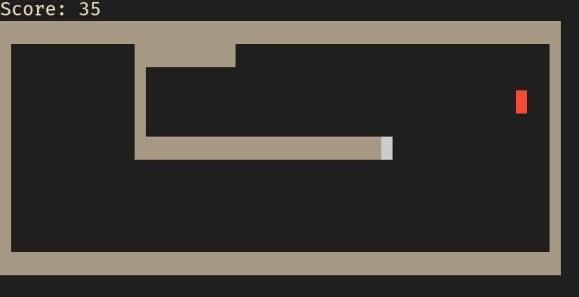

# Snakeli

> Streamed on https://twitch.tv/zartisimo ([video](https://www.twitch.tv/videos/2025056082))

I was bored. Feel free to copy the crappy code, I don't care :D

## References

- Game loop: https://gameprogrammingpatterns.com/game-loop.html

## TODOs

1. Improve the code overall
2. Parametrize the board size
3. Implement pause
4. Add score or something like that
5. Prompt for new game when losing
