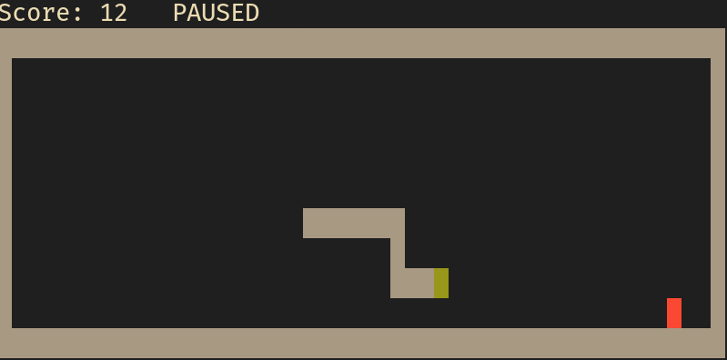

# Snakeli

> Feel free to fork/copy the code for yourself, I don't care :D

Random project born from boredom. You can use it to get used to vim keys for
moving around. Just give it a `-vim` flag and only hjkl keys will work for
movement.

Controls:
    - `<Control>c`: quit
    - `<Space>`: pause
    - `n`: increase speed
    - `m`: decrease speed
    - `<Up> | k | w`: go up (only `k` will work in vim mode)
    - `<Down> | j | s`: go down (only `j` will work in vim mode)
    - `<Left> | h | a`: go left (only `h` will work in vim mode)
    - `<Right> | l | d`: go right (only `l` will work in vim mode)



## Usage

```
Snakeli - v1

snakeli [-w 50] [-h 30] [-l 5] [-m TRIM]

    --help  print this help
        -w  width of the board
        -h  height of the board
        -l  initial length. It has to be less than w-2 (48 by default)
        -m  game mode. REGULAR by default:
              - TRIM: Snake eats itself
              - REGULAR: Snake eats itself
```

## Features

1. Configurable board size
2. Pausable
3. 2 game modes
    3.1. REGULAR: If snake hits itself, you lose
    3.2. TRIM: If snake hits itself, it loses from the hit to its tail
4. Restart
5. Score
6. Vim-only mode using `-vim` flag. Allowed movement keys: h(left) j(down) k(up) l(right)
7. Snake speed can be modified with n(increase) and m(decrease) keys

## References

- Game loop: https://gameprogrammingpatterns.com/game-loop.html
- First part streamed on https://twitch.tv/zartisimo ([video](https://www.twitch.tv/videos/2025056082))

## TODOs

1. Poll for inputs during (0.8 x ms_per_frame) and process them afterwards.
    This is the only way to create multiplayer
2. Add multiplayer (friendly or unfriendly?)
3. ¯\\_(ツ)_/¯

